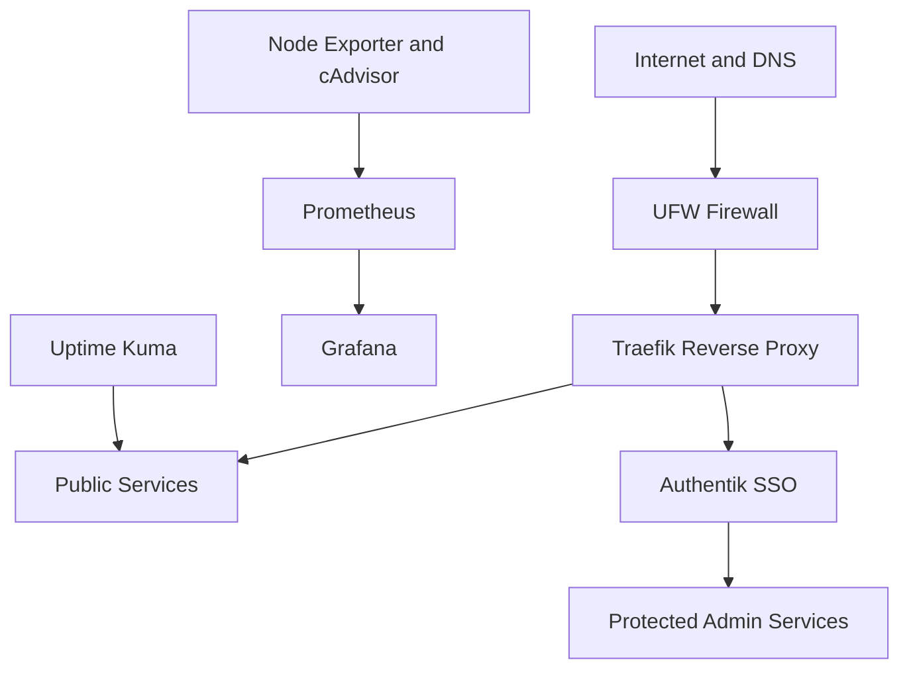

# DuzgunDev Infrastructure

Documentation of my self-hosted, production-like Linux environment. I use this project to practise system integration, container operations, monitoring, access control, troubleshooting, and technical documentation.

Live portfolio: [duzgundev.de](https://duzgundev.de)

## Architecture

Only ports required for administration and web traffic are publicly exposed. Administrative applications are protected separately from public services.

## Technology stack

| Area | Technologies |
|---|---|
| Host | Ubuntu Linux, UFW, SSH |
| Containers | Docker, Docker Compose, Portainer |
| Proxy and TLS | Traefik, Let's Encrypt |
| Identity | Authentik, SSO, ForwardAuth |
| Monitoring | Prometheus, Grafana, Node Exporter, cAdvisor |
| Availability | Uptime Kuma |
| Cloud service | Nextcloud, PostgreSQL, Redis |
| Operations | Bash, cron, logs, SHA-256 checksums |

## What I implemented

- Domain-based routing through a central reverse proxy
- Automatic TLS certificates for public endpoints
- Central authentication for protected administration tools
- Container and host metrics with Prometheus exporters
- Grafana dashboards for infrastructure visibility
- Availability checks for selected services
- Automated backups with logging and checksum verification
- Separation of public information from sensitive operational data

## Repository scope

This repository focuses on architecture, decisions, and lessons learned. It intentionally excludes:

- passwords, tokens, and API keys
- internal IP addresses and private DNS records
- production environment files
- complete database dumps or volumes
- identifiers that could weaken the security of the live environment

## Lessons learned

- Reverse-proxy configuration should be tested independently from application configuration.
- Authentication redirects require consistent external URLs and trusted proxy settings.
- Monitoring is useful only when metrics are understandable and do not expose sensitive details.
- A backup is not complete until its integrity and restoration process can be verified.
- Clear naming and separated Compose stacks make troubleshooting significantly easier.

## Next steps

- Expand technical documentation
- Add sanitized configuration examples
- Improve alerting and service-level views
- Document recovery tests
- Add architecture decision records

## Security

Please see [SECURITY.md](SECURITY.md). Do not report security issues through a public GitHub issue.
